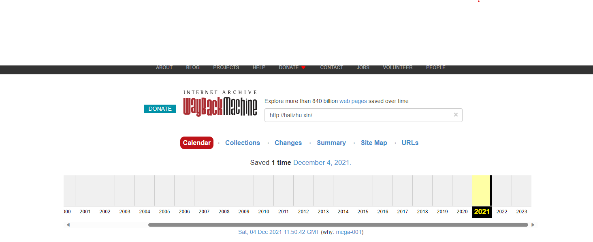

## 写在最前面

还记得当时上大学的时候，觉得搞个博客挺酷的，于是就趁着阿里云的学生优惠，买了一台服务器，顺便注册了**haiizhu.xin**这个域名，搞了一个十分花里胡哨的二次元页面，在上面发一下自己道听途说瞎捣鼓的东西。可惜毕业后负担不起服务器，现在连个存档都没留下来，现在想想还有点可惜。

## 写在最后面
工作之后，虽然探索、了解的东西越来越多，可是自己记录东西的时间缺越来越少了，希望能借这个免费的域名，多保留一些自己的思考吧。
